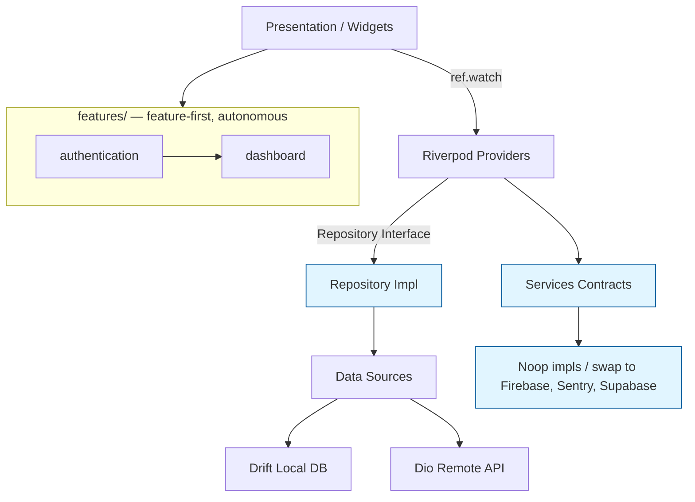

# 🦄 Flutter Clean Arch Unicorn

> **Clean Architecture · Riverpod 3 · 128 unit tests · v1.7.0**

**The foundation for a startup that will become a unicorn.**

This is not a "hello world" or a "quick prototype". It's a production-ready template engineered so that **you won't have to rewrite your code two years from now**.

---

## Why this template?

### 🟢 Easy
**A new developer is up and running in 3 minutes.**

- `make.bat setup` — install dependencies
- `make.bat run-dev` — launch dev environment
- Feature-first structure: `features/{name}/{data,domain,presentation}` — intuitive navigation
- 128 unit tests verify nothing is broken

### 🔒 Secure
**Secrets never leak into git. Tokens are encrypted.**

- `scripts/check_secrets.sh` — blocks commits with API keys
- `SecureStorage` — tokens stored in iOS Keychain / Android EncryptedSharedPreferences
- `--dart-define` — BASE_URL and keys are build arguments, not hardcoded
- `Either<L,R>` — errors are handled, not thrown as exceptions

### 🛡️ Reliable
**128 unit tests. CI/CD. Monitoring ready.**

- **128 unit tests** — 0 failures
- **GitHub Actions** — format → analyze → test → build in ~7 minutes per PR
- `ExceptionHandler` — centralized network error handling (Socket, Dio, timeouts)
- `ErrorReporter` and `Analytics` interfaces — ready for Crashlytics / Sentry (not bundled)

### 💰 Cheap
**One codebase — two platforms. Free CI.**

- **Flutter** — write once, run on iOS and Android. Saves 2x engineering cost
- **GitHub Actions** — free for public repositories
- **Retry interceptor** — fewer redundant requests on network failures (saves bandwidth)
- **Minimal dependencies** — only what you actually need. No bloat

### 📈 Scalable
**Clean Architecture. Branch-ready for 1M+ users.**

- **Clean Architecture** — `domain` layer never imports `data`/`presentation`. Swap DB, API, or UI — business logic stays intact
- **Riverpod 3 (compile-time DI)** — if a provider import is wrong, the code won't compile. Errors caught before deployment
- **3 built-in environments** — dev/staging/prod via `--dart-define`
- **Roadmap to Unicorn** — step-by-step plan: from 0 to 1,000,000 users without rewriting

---

[](LICENSE)

---

## 🤖 AI-Agent Ready

This repo is optimized for AI coding agents (Hermes Agent, Claude Code, Copilot, Cursor, Gemini, Codex, Jules):

| File | Purpose |
|------|---------|
| [`AGENTS.md`](AGENTS.md) | Full agent guide: structure, rules, commands ([agents.md](https://agents.md) standard) |
| [`llms.txt`](llms.txt) | Machine-readable project summary ([llmstxt.org](https://llmstxt.org) standard) |
| [`CLAUDE.md`](CLAUDE.md) / [`GEMINI.md`](GEMINI.md) | Entry points for Claude Code / Gemini CLI |
| [`.github/copilot-instructions.md`](.github/copilot-instructions.md) | GitHub Copilot instructions |
| [`.cursor/rules/`](.cursor/rules/) | Cursor project rules |

Point any agent at this repo — it will understand the architecture, run the tests, and follow the Dependency Rule without extra prompting.

---

## Stack

| Component | Package | Version |
|-----------|---------|---------|
| Framework | Flutter | 3.44.8 |
| State Management | flutter_riverpod | 3.4.1 |
| Navigation | go_router | 16.3.0 |
| Code Generation | freezed | 3.2.5 |
| HTTP Client | dio | 5.11.0 |
| Security | flutter_secure_storage | 10.0.0 |
| Local DB | drift | 2.34.3 |
| Logging | logger | 2.5.0 |
| Observability | Noop interfaces (Logger, ErrorReporter, Analytics, FeatureFlags) | — |

> **Note:** This template ships **Noop implementations** for observability (Crashlytics, Analytics, Remote Config). The interfaces are ready — drop in Firebase (or Sentry) when you need it. No `firebase_*` packages are bundled by default.

## Structure

```
lib/
├── configs/              # Global configs (AppConfigs)
├── features/             # Isolated feature modules
│   ├── authentication/   # data/domain/presentation
│   ├── dashboard/        # data/domain/presentation
│   └── splash/           # Splash screen
├── main/                 # Entry points (dev/staging/prod)
├── routes/               # GoRouter (app_router.dart)
├── services/
│   ├── observability/    # Logger, ErrorReporter, Analytics
│   ├── security/         # SecureStorage, interceptors
│   ├── network/          # Interceptors (retry, auth, logging)
│   └── user_cache_service/ # Local user cache (SharedPreferences + SecureStorage)
├── core/
│   └── database/         # Drift local relational DB (typed tables, migrations)
└── shared/               # Models, theme, exceptions, widgets
```

Each feature is an autonomous module: `data/` (implementations), `domain/` (business logic), `presentation/` (UI + providers).

## Quick Start

```bash
# Windows
make.bat setup       # Install dependencies
make.bat run-dev     # Start dev environment
make.bat check       # Analyze + Test + Format
make.bat build-apk   # Build Android APK

# Unix/Mac
make setup
make run-dev
make check
```

```bash
# Custom API endpoint
flutter run --dart-define=BASE_URL=https://my-api.com
```

## Environments

| Entry point | Purpose |
|-------------|---------|
| `lib/main/main_dev.dart` | Dev build |
| `lib/main/main_staging.dart` | Staging |
| `lib/main/main_prod.dart` | Production |

> Default `flutter run` uses `lib/main.dart` → `mainCommon(AppEnvironment.DEV)`.

## Testing

```bash
flutter test              # all tests (128)
flutter test --coverage   # with coverage
```

Pattern: `ProviderContainer` + `mocktail`, each provider tested in isolation.

## CI/CD

GitHub Actions on every PR:
1. `flutter pub get`
2. `dart run build_runner build --delete-conflicting-outputs` — generate freezed/drift code
3. `dart format --set-exit-if-changed .`
4. `flutter analyze lib/ test/ --fatal-infos` (0 issues)
5. `dart run tool/check_boundaries.dart` — feature-boundary enforcement
6. `flutter test --coverage`
7. Coverage gate (min 30%, excluding generated files)
8. `flutter build apk --debug`

## Requirements

- **Flutter SDK** 3.44.8+
- **Android SDK** (platforms/android-34, set `ANDROID_HOME` or `local.properties`)
- **JDK** 17+ (for Android builds)

## Versioning

Semantic tags (`v1.5.0`, `v1.3.0`). Every change is a commit + tag. Current version: **1.7.0**.

---

## 🦄 What you get at each stage

| Stage | What you get |
|-------|--------------|
| **VibeCoder** | `clone` → `flutter pub get` → `flutter run`. Starter UI, auth flow, GoRouter, Riverpod 3, `tool/new_feature.dart` generator, SecureStorage, error handling, light/dark theme. Zero config needed. |
| **MVP** | Drift local DB, Repository pattern, Freezed models, Dio networking, auth guard, environments (dev/staging/prod), 128 tests. Replace `Noop` services with real SDKs when needed. |
| **Scale** | Feature boundaries enforced (CI boundary-check), shared/ discipline, caching (cache-then-remote), CI (format→analyze→test→build), observability contracts (Logger/ErrorReporter/Analytics/FeatureFlags/Performance). |
| **Unicorn** | Package-ready features, vendor-independent architecture (Firebase/Supabase/Sentry swap via interfaces), performance extension point, AI-agent docs (AGENTS.md, llms.txt, docs/AI_DEVELOPMENT_RULES.md). |

## 🚀 Roadmap to Unicorn

This template is your **Day 0 foundation**. Scale it as you grow:

| Stage | Users | What to add | Why |
|-------|-------|-------------|-----|
| **Day 0** | 0-100 | ✅ Template as-is | Validate idea, zero cost |
| **Month 1** | 100-1K | Firebase Analytics + Crashlytics | Know what breaks |
| **Month 3** | 1K-10K | Offline-first (Drift) | Work without internet |
| **Month 6** | 10K-100K | Push Notifications (FCM) | Re-engage users |
| **Year 1** | 100K+ | Feature Flags (Firebase Remote Config) | Ship without deploying |
| **Year 2** | 1M+ | BFF (Backend for Frontend) | Reduce API calls |

**Key principle:** Replace `Noop` implementations in `lib/services/` with real ones when needed. The interfaces are already there.

---

## 📸 Screenshots

> Add real app screenshots here after running the template (emulator or device):
> `screenshots/login.png`, `screenshots/dashboard.png`, `screenshots/products.png`.
> This section is intentionally a placeholder — no fabricated images are shipped.

---

## 🏗️ Architecture



Key rules: Widgets never import Dio/DB directly (§12). Feature A never imports
Feature B internals (§11). Infrastructure injected via Riverpod (§14).

---

## 📖 Further Reading

- [ARCHITECTURE.md](./ARCHITECTURE.md) — deep dive into the architecture
- [UNICORN_FOUNDATION_REQUIREMENTS.md](./UNICORN_FOUNDATION_REQUIREMENTS.md) — full requirement spec
- [CONTRIBUTING.md](./CONTRIBUTING.md) — how to contribute
- [SECURITY.md](./SECURITY.md) — security policy & threat model
- [docs/adr/](./docs/adr/) — Architecture Decision Records